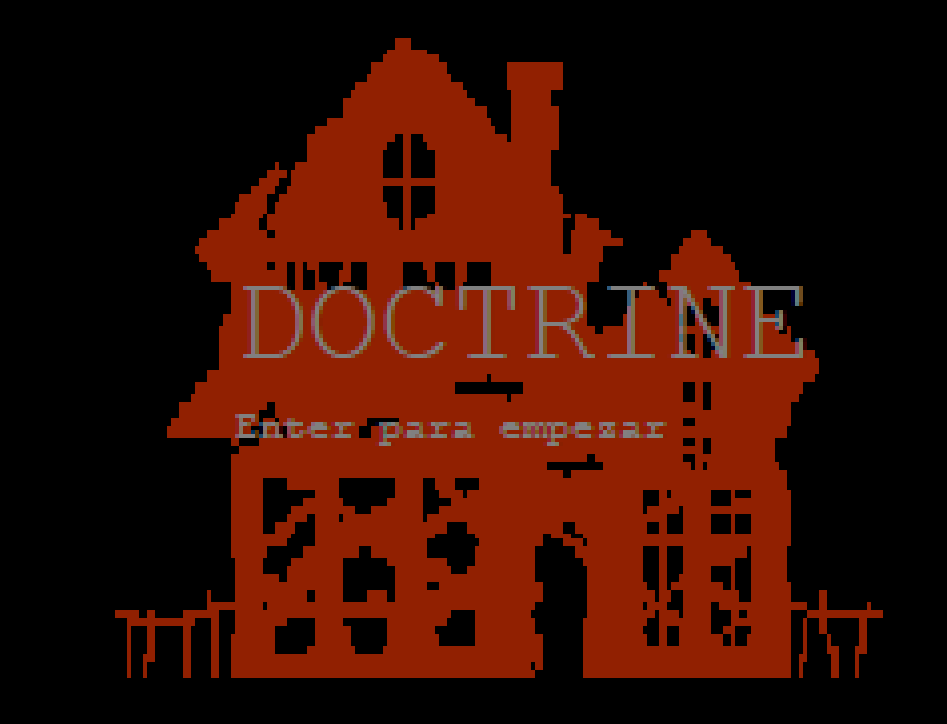
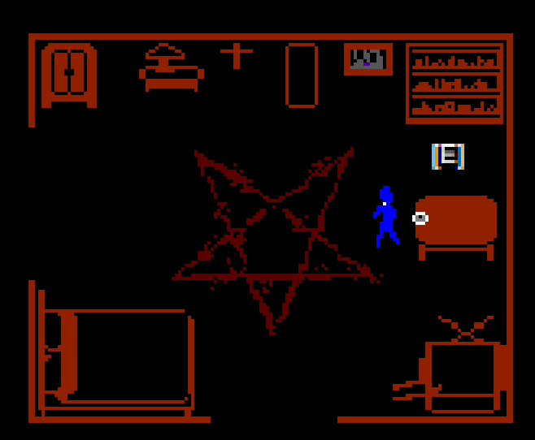

#  DOCTRINE  
**Un juego narrativo en 2D desarrollado con HTML5 Canvas inspirado en "FAITH"**

##  Descripción general  
*Doctrine* es una experiencia simbólica y psicológica en formato de juego 2D.  
El jugador explora una habitación cerrada, interactuando con objetos cargados de significado como espejos, notas, muebles y símbolos rituales.  
Cada acción altera la atmósfera del entorno, revelando fragmentos de una narrativa inquietante.

##  Mecánicas principales  
- Movimiento libre con detección de colisiones  
- Interacción con objetos clave (nota, TV, armario, espejo)  
- Activación de eventos narrativos y visuales  
- Transición a un segundo escenario: el bosque 
- "sistema de progreso"

##  Recursos visuales  
- Sprites personalizados para entidades y objetos  
- Imágenes estáticas  para ambientación  
- Fondo negro para el bosque, con árboles y atmósfera ritual

##  Sonido y atmósfera  
- Efectos de sonido para eventos clave  
- Silencio ambiental para reforzar tensión  

**Final oscuro:**  
> *“La doctrina te nombró en voz baja. Y el bosque respondió con olvido.”*

**Final de escape:**  
> *“La doctrina guardó silencio. Y tú cruzaste antes de que cambiara de idea.”*

## Implementación técnica  
- HTML5 Canvas para renderizado  
- JavaScript para lógica de juego  
- CSS para presentación visual  
- Desplegado en navegador (compatible con PC)

##  Estado actual  
El juego está en estado de prototipo funcional.  
Algunas funciones pueden estar simplificadas o sujetas a ajustes según tiempo y viabilidad.  

## Cómo jugar
**Prerequisito:** Tener [Live Server](https://marketplace.visualstudio.com/items?itemName=ritwickdey.LiveServer) instalado en VS Code.

1. Clona el repositorio: `git clone https://github.com/lopez580/Doctrine`
2. Abre la carpeta en VS Code
3. Click derecho en `index.html` → "Open with Live Server"

